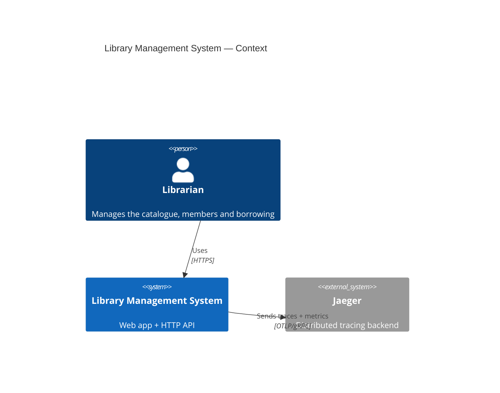
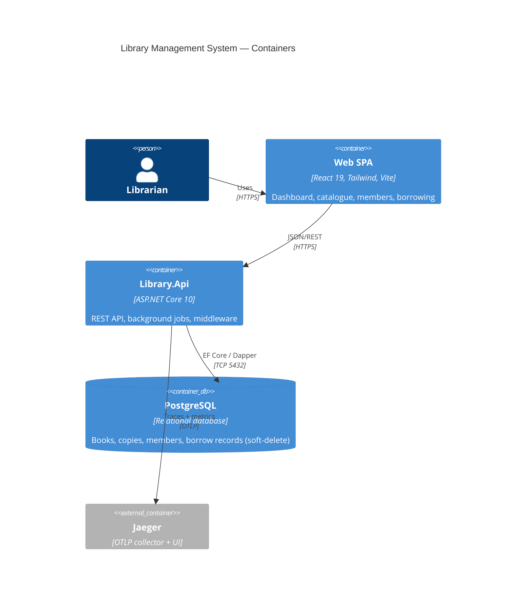
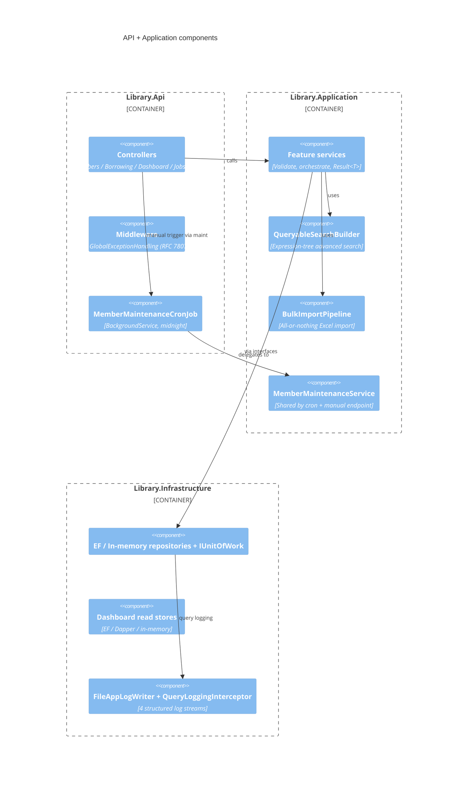

# C4 Architecture Diagrams

## Level 1 — System Context

```mermaid
C4Context
  title Library Management System — Context
  Person(librarian, "Librarian", "Manages the catalogue, members and borrowing")
  System(lms, "Library Management System", "Web app + HTTP API")
  System_Ext(jaeger, "Jaeger", "Distributed tracing backend")
  Rel(librarian, lms, "Uses", "HTTPS")
  Rel(lms, jaeger, "Sends traces + metrics", "OTLP/gRPC")
```

## Level 2 — Containers

```mermaid
C4Container
  title Library Management System — Containers
  Person(librarian, "Librarian")
  Container(web, "Web SPA", "React 19, Tailwind, Vite", "Dashboard, catalogue, members, borrowing")
  Container(api, "Library.Api", "ASP.NET Core 10", "REST API, background jobs, middleware")
  ContainerDb(db, "PostgreSQL", "Relational database", "Books, copies, members, borrow records (soft-delete)")
  Container_Ext(jaeger, "Jaeger", "OTLP collector + UI")
  Rel(librarian, web, "Uses", "HTTPS")
  Rel(web, api, "JSON/REST", "HTTPS")
  Rel(api, db, "EF Core / Dapper", "TCP 5432")
  Rel(api, jaeger, "Traces + metrics", "OTLP")
```

## Level 3 — Components (Library.Api + Library.Application)

```mermaid
C4Component
  title API + Application components
  Container_Boundary(api, "Library.Api") {
    Component(controllers, "Controllers", "Books / BookCopies / Members / Borrowing / Dashboard / Jobs / Metadata / ReleaseNotes")
    Component(mw, "Middleware", "CorrelationId, GlobalExceptionHandling (RFC 7807), RateLimiter")
    Component(jobs, "MemberMaintenanceCronJob", "BackgroundService, midnight")
  }
  Container_Boundary(app, "Library.Application") {
    Component(services, "Feature services", "Validate, orchestrate, Result<T>")
    Component(search, "QueryableSearchBuilder", "Expression-tree advanced search")
    Component(import, "BulkImportPipeline", "All-or-nothing Excel import")
    Component(maint, "MemberMaintenanceService", "Shared by cron + manual endpoint")
  }
  Container_Boundary(infra, "Library.Infrastructure") {
    Component(repos, "EF / In-memory repositories + IUnitOfWork", "")
    Component(readstore, "Dashboard read stores", "EF / Dapper / in-memory")
    Component(logging, "FileAppLogWriter + QueryLoggingInterceptor", "4 structured log streams")
  }
  Rel(controllers, services, "calls")
  Rel(controllers, jobs, "manual trigger via maint")
  Rel(services, search, "uses")
  Rel(services, import, "uses")
  Rel(services, repos, "via interfaces")
  Rel(jobs, maint, "delegates to")
  Rel(repos, logging, "query logging")
```
