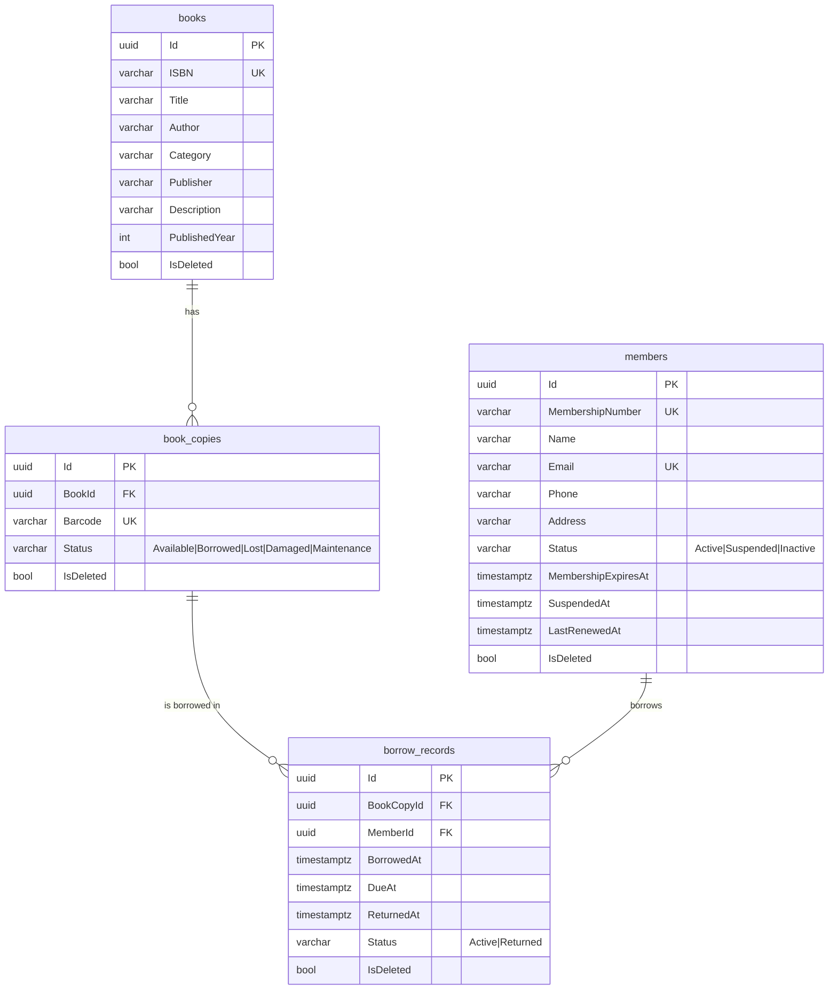

# Entity–Relationship Diagram

All tables carry `Id` (uuid, PK), `IsDeleted` (bool) + `DeletedAtUtc`, and
`CreatedAtUtc` / `UpdatedAtUtc` (shadow audit). Enums are stored as their string
name. FKs are `ON DELETE RESTRICT` (the app soft-deletes and cascades in a
transaction).

## Indexes

| Table | Index | Purpose |
|---|---|---|
| books | `ISBN` unique, `Title`, `Category`, `IsDeleted` | lookup, search, filter |
| book_copies | `Barcode` unique, `BookId`, `Status`, `IsDeleted` | dependents, availability |
| members | `MembershipNumber` unique, `Email` unique, `Status`, `MembershipExpiresAt`, `IsDeleted` | lookup, expiry sweep |
| borrow_records | `(MemberId, Status)`, `(Status, DueAt)`, `IsDeleted` | one-active-borrow, overdue scan |
